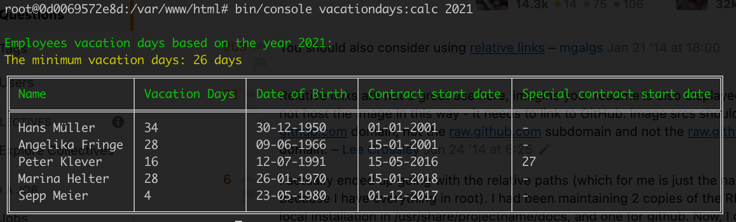

# Ottonova Task / Vacation Days Calculator
A simple project to calculate the total employees vacation days based on multiple logics/factors.

## Screenshot:


## Requirements:
- PHP 7.4
- Composer
- Docker

## Installation:
### Normal installation (without docker):
- Clone this repository to one of your local directories.
- Run the command:
```composer install```
- Now inside the directory, you can run the command to get the vacation days results.

### Install with Docker:
- Clone this repository to one of your local directories.
- Run the command ```docker-compose up -d --build```
- Access the docker container with the command ```docker exec -it ottonova-php74 bash```
- To install the  composer dependencies, run the command ```composer install``` (inside ```/var/www/html```)
- Now you are inside the container, so you can run the command to get the vacation days results.

## The Command example:
```./bin/console vacationdays:calc 2021```

## The unit testing command:
```./vendor/bin/phpunit```

## Assumptions:
- The special contract vacation days will override the minimum/default vacation days (not the total calculated days).
- The contracts starting not in the 1st day of the month, will not be considered as a full month, so the contracts starting from the 15th will be excluded from the calculation.
- The employee age calculation is based on the `year` input not the current date.